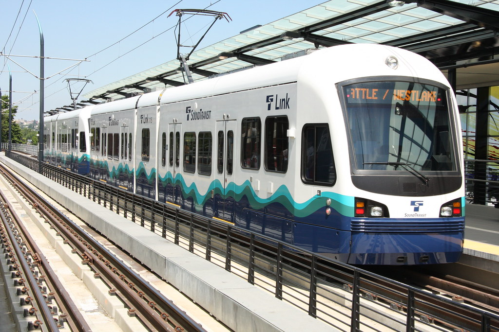
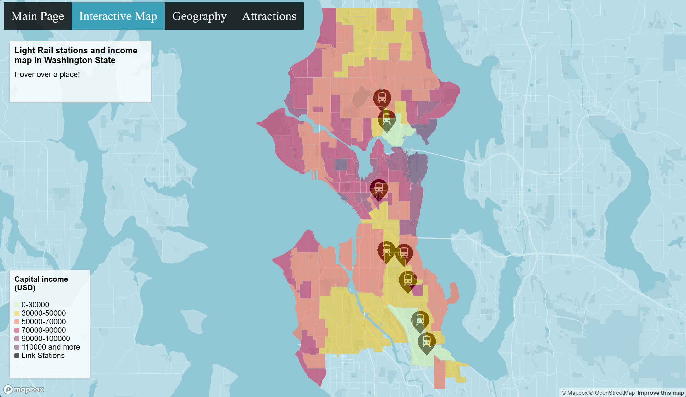
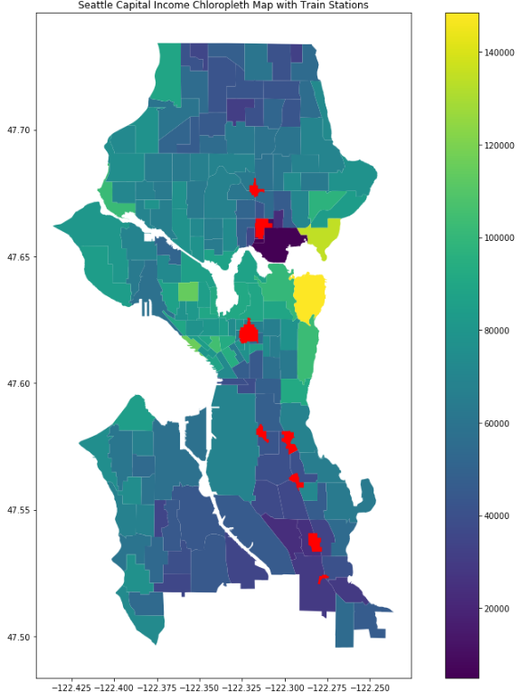

# Mapping Income Near Link Stations
[Web Application](https://jason-simi.github.io/interactivemap.html)

## Description
For our project, we chose to incorporate elements learned from labs 2 and 3. Our application has 3 main components: A main page with a quick description of the project, an interactive choropleth map representing the capital income for each census tract within the city of Seattle, and an evaluation page with interpretations of data and a clearer income map. Within the interactive map, we chose to use the topbar navigation elements from Lab 2. We overlaid that map with points representing each Link station, allowing us to compare the different income levels with where the stations are located. We chose census tracts to delineate the income distributions because the data was easily accessible and showed clear splits within the income distribution across the different neighborhoods being represented. The darker colors represent the higher income and the lighter colors represent the lower income. There is a clear pattern within the income distribution that we can see represented through the map; the higher income areas often congregate closer to the water and closer together, away from the inner city, where the neighborhoods with the lower incomes are situated. The Link stations are clearly represented on the map with points in the form of the Link logo and allow for easy analysis of the income levels in the same area. Within the evaluation page, we show a clear explanation of our interpretation of the spatial analysis our map allows, and include an income map displaying the same concepts: a clearer choropleth map showing income distribution in relation to train stations. Showing the income distribution on two different maps works to reinforce understanding of the relationship we are trying to represent. The interactive map gives the user the ability to zoom in and out of each census tract to get close-up understanding of where each Link station is situated, and the simpler choropleth on the evaluation page works as a clear, overall picture of the relationship that is helpful when understanding our analysis. 

## Screenshots
<strong>Interactive Map</strong>

<strong>Income Map</strong>

## Analysis of Results
Similar to the evaluation page, we have some clear takeaways from the spatial analysis our maps allow. Through this application and all of the features within it, we can see a clear pattern in regards to which areas the Link stations are situated in. All the neighborhoods with a Link station are considered “lower-income”; the area with the highest aggregate income with a Link station is the station in Capitol Hill, with a capital income of $54,848 per year. The areas with the lowest income and Link stations are Rainier Beach and Othello in south Seattle, with capital incomes of $29,206 and $24,970 per year respectively. Through this analysis, we can conclude that within the city of Seattle, the Link functions as a resource for all residents of the city but is intended as a resource for the lower-income population. Increased accessibility to public transportation can negate any need for a car and can maintain a sense of community and connectivity across the entire city, not isolating any one neighborhood because of socioeconomic status. Similarly, having easy to use and readily available public transportation within a low-income area can increase employment opportunities for low-income residents as they are able to easily get across the city. Having Link stations in a given area can also revitalize lower-income areas as it can boost economic activity within the areas that may not get as much traffic without the public transportation. Geographically, the inner city often has higher populations than the higher income, residential neighborhoods closer to the water, so centering a central public transportation system within higher population neighborhoods can serve to maximize the usability of the Link itself and facilitate the highest possible interconnectivity within different Seattle neighborhoods. 

## Goal
Through this project, we wanted to investigate the relationship between income demographics and Link stations. We had 3 main objectives: evaluate the income distribution of residents in close proximity to stations to find trends and disparities, investigate the accessibility and affordability of different income groups to transportation options, and analyze the influence of Light Rail stations on income levels in nearby neighborhoods and communities. 

## Data Sources

1. [Seattle Census Tract Data](https://data-seattlecitygis.opendata.arcgis.com/datasets/9075e8c912a24c4b9458af8866c72ae7)
2. [Per capita income and aggregate income over the last 12 months](https://data-seattlecitygis.opendata.arcgis.com/datasets/SeattleCityGIS::per-capita-income-and-aggregate-income-in-the-past-12-months-in-inflation-adjusted-dollars/about)
3. [Light Rail Station Overlay](https://data-seattlecitygis.opendata.arcgis.com/datasets/SeattleCityGIS::station-area-overlay-light-rail/explore?location=47.601176%2C-122.261905%2C12.81)

## Applied Libraries
1. Mapbox gl js
2. FontAwesome - hamburger icon

## Web Services
1. Github - For hosting
2. Mapbox API - to fetch map styles and data

## Acknowledgements
We would like to express our gratitude to the City of Seattle for generously providing the geospatial data used in creating this interactive choropleth map. Special recognition goes to the dedicated team at the City of Seattle for their commitment to transparency and accessibility in sharing the information we used about Light Rail stations and income distribution. We would also like to give special thanks to Lena Han from The Urbanist for her article on Seattle’s inequality and diversity with Light Rail for inspiring this project. 